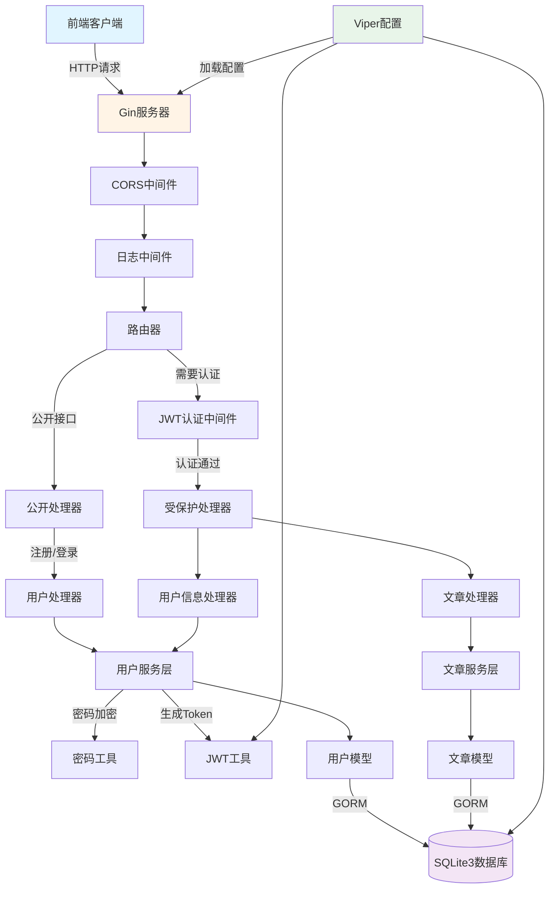
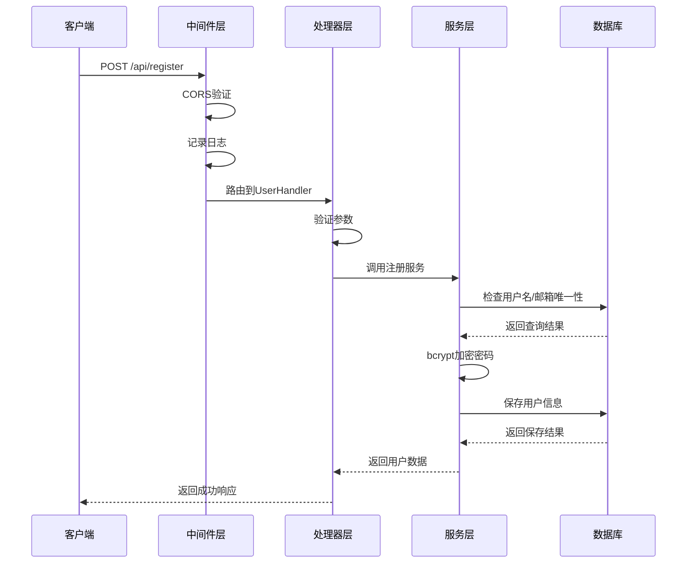
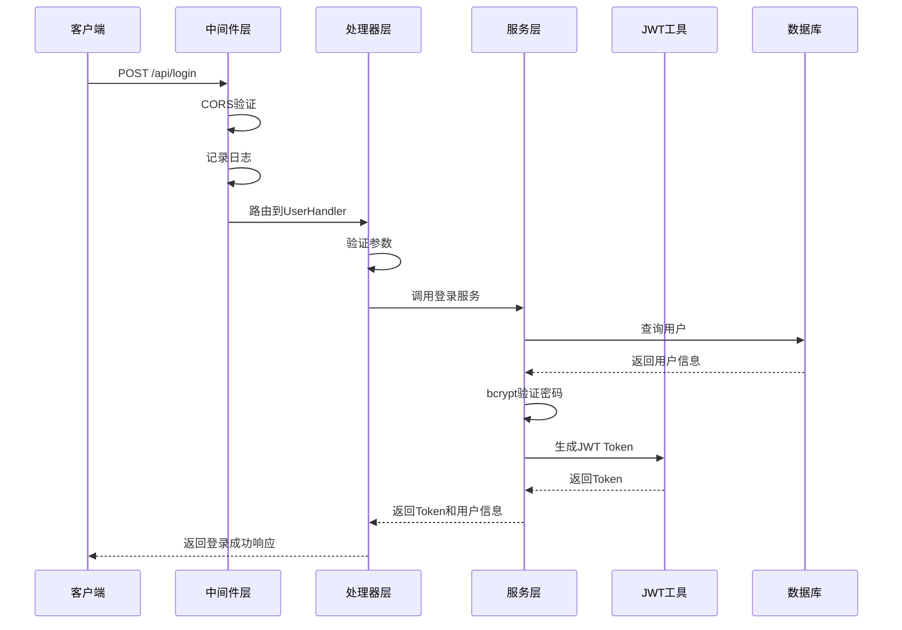
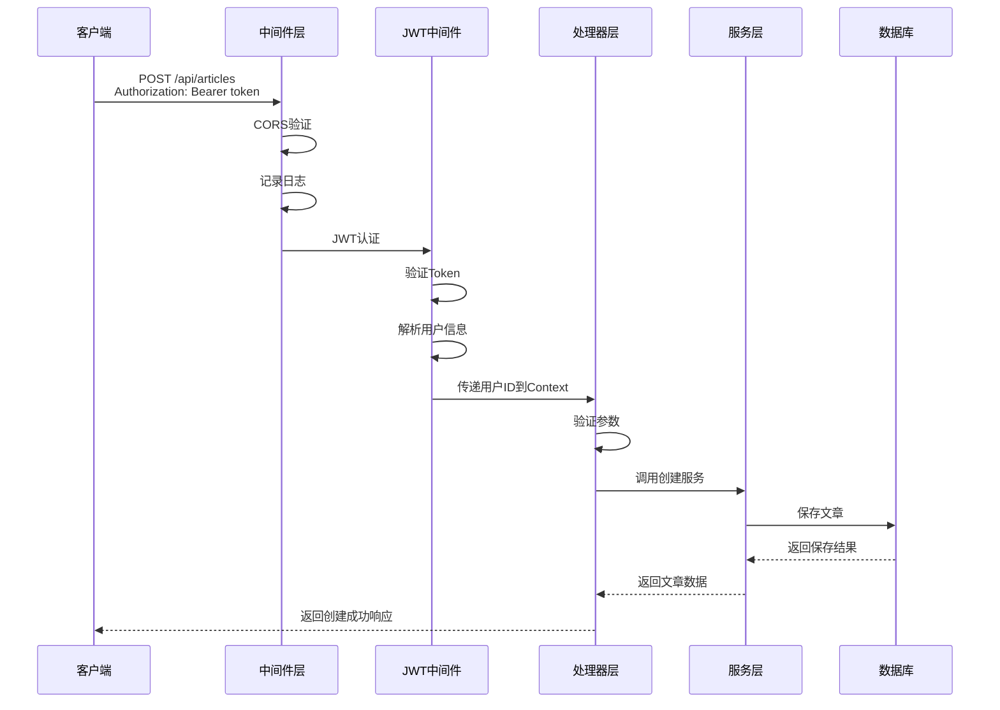
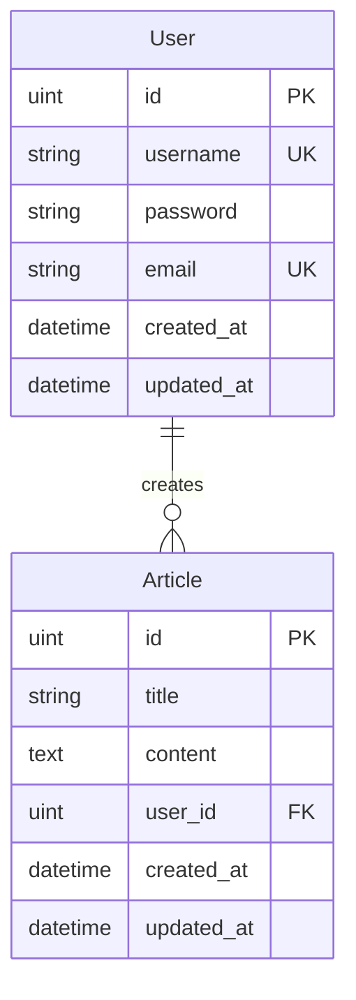
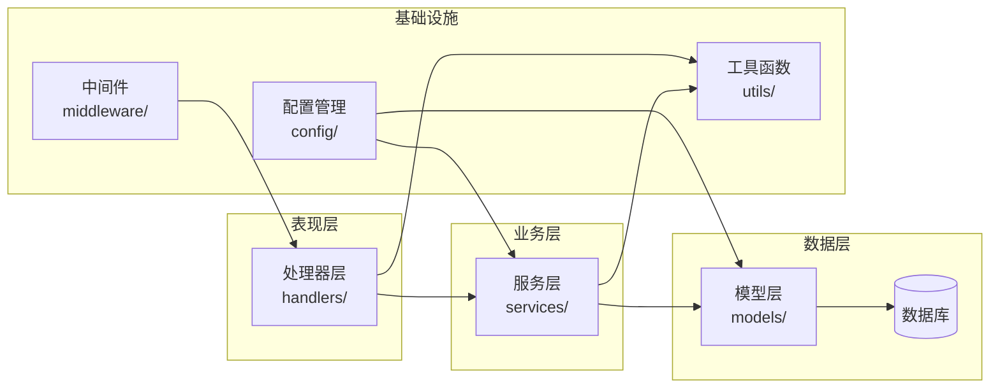
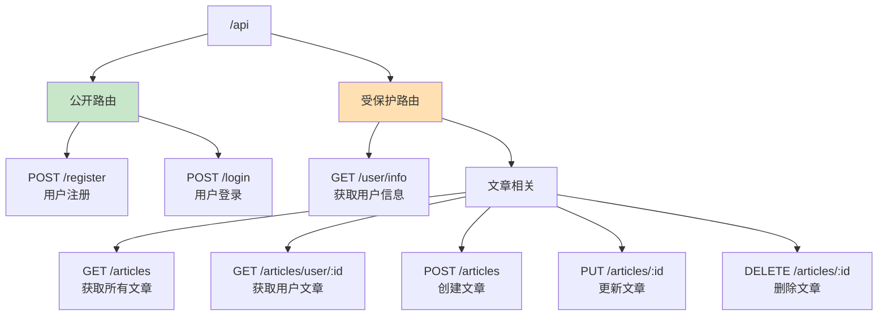

# 系统设计可视化

## 系统架构图

## 请求流程图

### 用户注册流程

### 用户登录流程

### 创建文章流程

## 数据库关系图

## 项目分层架构

## API路由结构

## 技术栈选择理由

| 技术 | 选择理由 |
|------|---------|
| Gin | 高性能、简洁的API、丰富的中间件生态 |
| GORM | 功能强大的ORM、支持多种数据库、易于使用 |
| SQLite3 | 轻量级、无需配置、适合小型项目 |
| JWT | 无状态认证、易于扩展、前后端分离友好 |
| bcrypt | 专为密码设计、慢速哈希、防止暴力破解 |
| Viper | 强大的配置管理、支持多种格式、易于使用 |

## 关键设计决策

### 1. 分层架构
- **Handler层**: 负责HTTP请求处理和参数验证
- **Service层**: 包含业务逻辑，可复用
- **Model层**: 数据模型和数据库操作

### 2. 中间件设计
- **CORS**: 允许前端跨域访问
- **Logger**: 统一日志格式，便于调试
- **Auth**: JWT认证，保护需要登录的接口

### 3. 统一响应格式
所有API返回一致的JSON格式，便于前端处理

### 4. 安全性考虑
- 密码使用bcrypt加密
- JWT token有效期限制
- 文章操作权限控制

### 5. 代码组织
- 按功能模块划分目录
- 每个模块职责单一
- 便于测试和维护